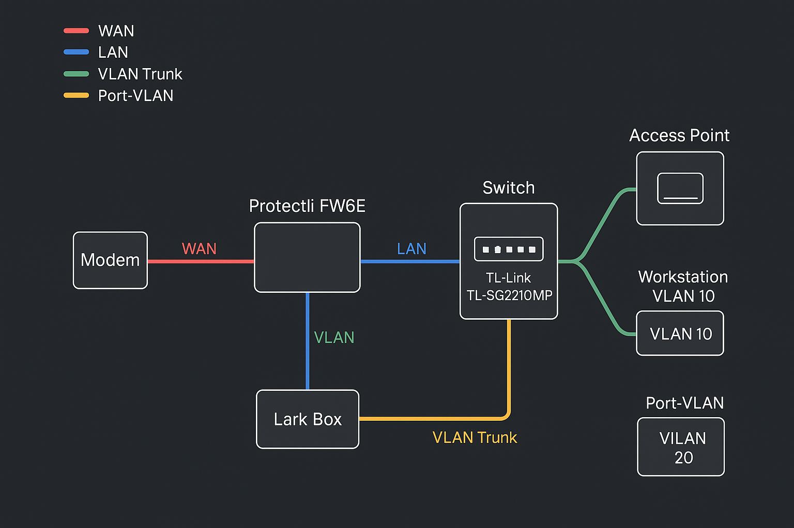

## OPNsense Firewall Segmentation for Homelab

# Overview

This repository documents the full build and setup of a segmented firewall using OPNsense on a Protectli Vault FW6E appliance. It is the main network part of a larger homelab project focused on quality segmentation, monitoring, and security practices. The goal of this project is to build a secure firewall that isolates internal network zones, limits unnecessary traffic, and enforces least privilege access across the environment.

All hardware was set up from scratch, starting with unboxing and preparing the Protectli Vault. RAM and storage were manually installed, and OPNsense was flashed to a bootable USB and installed onto the device. After installation, the device was configured using the web GUI. Logical interfaces were created and mapped to VLANs, each with its own subnet and DHCP server. Static IP reservations were made for key systems, gateway roles were defined, and firewall rules were created to enforce inter-zone security.

The Protectli device now acts as the main router, DHCP server, and firewall for six internal zones: LAN, LAB, HOME, IOT, GUEST, and DMZ. It also provides a single WAN uplink via an ARRIS S34 cable modem.

## Network Zones

- LAN: Core management zone, admin systems, backups, SIEM access
- LAB: Penetration testing, internal dev, learning tools, network scans
- HOME: Trusted household devices and work-from-home systems
- IOT: Smart TVs, cameras, media players, game consoles
- GUEST: Internet-only for untrusted or visitor devices
- DMZ: Airgapped testing zone, used for deeper research or honeypot-style services

Each zone is isolated into its own VLAN with a dedicated subnet and DHCP scope. OPNsense manages all IP assignments and provides static reservations for critical devices. Traffic between zones is denied by default, with only specific allow rules configured.

## Features and Firewall Design

Firewall rules are written at the interface level with a default-deny policy across all VLANs. Each interface includes explicit allow rules for internet access and defined exceptions where needed. Deny rules log all attempts for future review. Inter-zone access is minimal and based on operational need only.

The LAN VLAN can reach all other zones and is reserved for administrative control. The LAB VLAN has internet access and can send logs to the LAN, but cannot access HOME, IOT, or GUEST. The HOME VLAN can use outbound internet and communicate with IOT devices for casting and media control, but cannot access LAN, LAB, or GUEST zones. The IOT and GUEST VLANs are locked down to internet-only access. The DMZ is isolated entirely from other VLANs and may be used for offensive security experiments or sandboxed services.

Suricata is enabled in legacy mode on the LAN and LAB interfaces for packet-level visibility and intrusion detection.

## Deployment Challenges and Lessons

Setting up the Protectli Vault with OPNsense required careful planning and rebuilding. During the initial setup, OPNsense defaults to assigning the LAN interface to igb0. This conflicted with the intended layout, where igb0 would be used for WAN and igb1 would become the trunk port carrying all VLANs. The original plan was to temporarily set up the firewall using igb0 for the GUI, then later migrate the GUI to a VLAN interface on igb1. During this migration attempt, GUI access was lost due to misconfiguration, and recovery was not feasible without console access. As a result, the firewall had to be rebuilt multiple times. The lesson was learned. Remember to back up configurationg before leaving the GUI!!!!

Eventually, the firewall was brought online with igb0 assigned as WAN and igb1 assigned as the LAN trunk interface. After configuring VLANs and switch port tagging, the GUI was successfully moved to VLAN 20 (LAB). This allowed workstations on the LAB VLAN to manage the firewall permanently through a tagged port on the managed switch. This design provides flexibility while aligning with the homelab's segmented and least-trust model.

## VLAN and Interface Layout

- igb0: WAN (connected to ARRIS S34 modem)
- igb1: LAN trunk (carries VLANs 10 through 60)

- VLAN 10: LAN - admin systems and secure access
- VLAN 20: LAB - research, learning, pen-testing
- VLAN 30: HOME - trusted personal devices, WFH setups
- VLAN 40: IOT - smart TVs, Ring, audio, consoles
- VLAN 50: GUEST - internet-only access for visitors
- VLAN 60: DMZ - sandbox and isolated testing zone

## Future Work

- Add full WireGuard VPN setup with strict firewall controls
- Build out the LAB zone’s SIEM and monitoring stack on a dedicated mini PC
- Continue integrating VLAN-aware services like Pi-hole, Gitea, and PXE boot
- Complete switch tagging documentation and visual network diagrams
- Create automation scripts for backup, alerts, and firewall config versioning

## Diagram

## Images

The `/images/` folder contains a complete visual walkthrough of the project, including:
- Physical hardware preparation
- OPNsense installation steps
- Web GUI initialization
- Firewall rule layout
- Final dashboard views

## Docs

See the `/docs/` folder for full documentation on:

- Network and VLAN configuration
- Firewall rule breakdowns and access policies
- Step-by-step installation and setup process
- Detailed rationale for segmentation and rule design

This repository is meant to be both a personal guide and a practical example of hands-on network engineering and system hardening. It reflects the realities of iterative configuration, rebuilding, and refining a segmented homelab firewall using open source tools.

